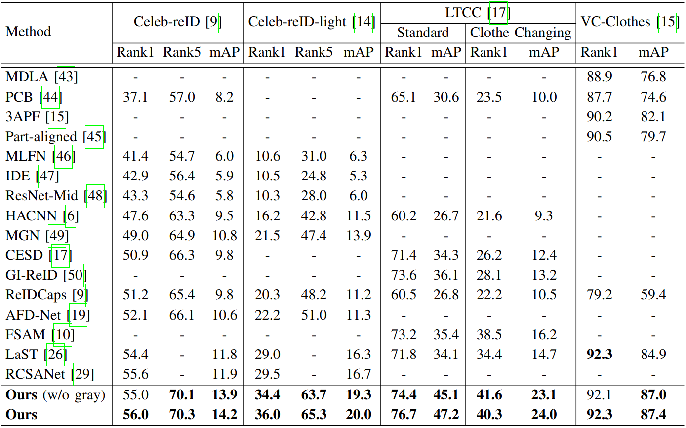

# SirNet
[[Project]](https://vcl.seoultech.ac.kr/research.html) [Paper] [[arXiv]](https://arxiv.org/abs/2209.09574)

This is the official code of our **"Sampling Agnostic Feature Representation for Long-Term Person Re-identification"**, IEEE Transactions on Image Processing (TIP), 2022.

## Overview
</center>

## Prerequisites

- Python 3.8.8
- CUDA 11.0
- Pytorch 1.7.1
- Sklearn 0.24.1
- processingtools 0.2.5

Please check *requirements.txt* for other packages.


## Training

```
python -m train_utils.train --data_root=<> --configs=<> --batch_size=2 --save_path=<> --epoch=<> --workers=4 --snapshot --rerank
```
### snapshot
**(notice) <u>Argument 'snapshot' will save the current folder. Thus, the save path must not include the current path. </u>**

### epoch
In each dataset, we used the below epoch values.
- Celeb-reID: 15
- Celeb-reID-light: 60
- LTCC: 100
- VC-Clothes: 80

### configs
Config files are provided in *configs* folder. 

### Dataset
Download each dataset before running code.
- [Celeb-reID & Celeb-reID-light](https://github.com/Huang-3/Celeb-reID)
- [LTCC](https://naiq.github.io/LTCC_Perosn_ReID.html)
- [VC-Clothes](https://wanfb.github.io/dataset.html)

If you use Celeb-reID dataset or Celeb-reID-light dataset, just set '--data_root' as dataset root, 
**however, if you want to use other dataset, you need to change dataset form as Celeb-reID dataset form.**

You can use provided files in *change_form*.

## Evaluating
```
python -m evaluate.evaluate --data_root=<> --configs=<> --batch_size=2 --save_path=<> --workers=4 --model=<> --rerank
``` 

### Dataset
If you use Celeb-reID dataset, Celeb-reID-light dataset or VC-Clothes dataset, just run the *evaluate.py* file in evaluate, 
**however if you want to use LTCC datasets, you need to modify [Clothes_Change_Person_ReID](https://github.com/xiangzhouzhang/Clothes_Change_Person_ReID) to get proper results.**

### Results
</center>
You can download pre-trained models [here](https://o365seoultech-my.sharepoint.com/:f:/g/personal/20512067_officestu_seoultech_ac_kr/Ene_Gnt3aktOumAr16_8ixABeo1rPUox98gs-fC7oLEHXA?e=yo73xd).

## License
Our code and the *models/AdaINGenerator.py* is under the [CC BY-NC-SA 4.0](https://creativecommons.org/licenses/by-nc-sa/4.0/legalcode) (**Attribution-NonCommercial-ShareAlike 4.0 International**). You can check [here](https://github.com/NVlabs/DG-Net) for models/AdaINGenerator.py.
 
